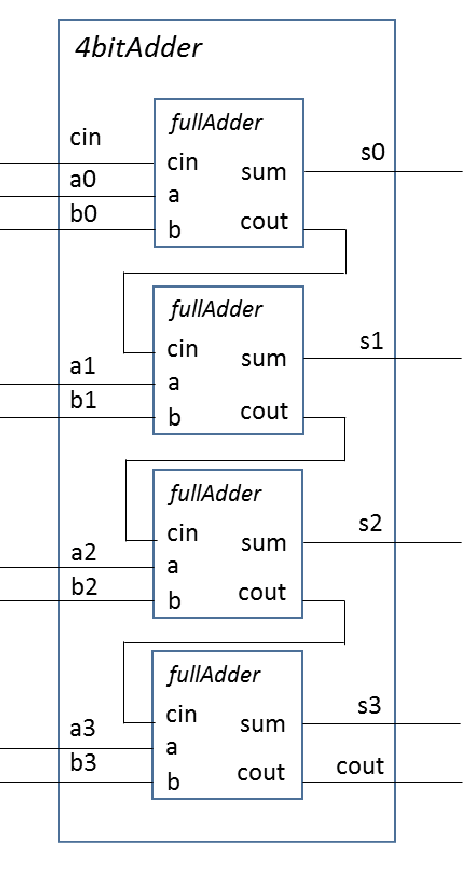

# Homework 3 – 4-bit Full Adder Implementation (ECE:3350 Spring 2025)

This homework implements a 4-bit Full Adder in Verilog by connecting four 1-bit full adders. The implementation demonstrates structural Verilog design principles and hierarchical module composition.



## Project Structure

The project is organized in the `homework_3` folder and contains the following components:

### 1-bit Full Adder Module

The basic building block is a 1-bit Full Adder with the following implementation:

```verilog
// 1-bit Full Adder  
module fullAdder (a, b, cin, sum, cout);  
    input a, b, cin;    
    output sum, cout;  
    reg sum, cout;  

    always @(a or b or cin) begin  
        sum = #2 a ^ b ^ cin;  
        cout = #2 (a & b) | (a & cin) | (b & cin);  
    end  
endmodule  
```

### 4-bit Full Adder Design

The 4-bit Full Adder is constructed by connecting four instances of the 1-bit full adder. The carry-out (cout) of each stage is connected to the carry-in (cin) of the next stage to propagate the carry through all four bits.

### Verification

The design is verified using a testbench that applies five different test cases with a 50 ns delay between each case. The testbench confirms the correct operation of the 4-bit adder under various input conditions.

## Source Code
- [four_bit_full_adder.v](./four_bit_full_adder.v)
- [one_bit_full_adder.v](./one_bit_full_adder.v)
- [testbench_four_bit_full_adder.v](./testbench_four_bit_full_adder.v)