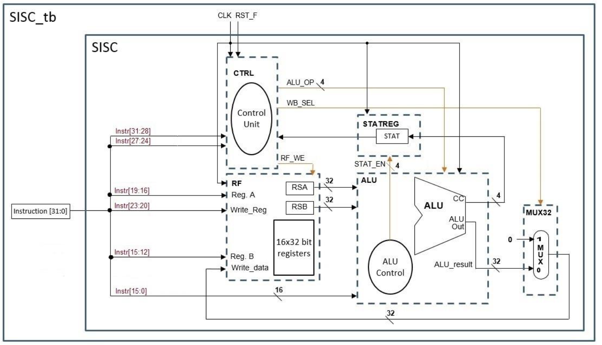

# Project Part 1: Simple Instruction Set Computer (SISC)

## Overview
This project is part of the ECE:3350 Computer Architecture and Organization course for Spring 2025. It involves implementing a Simple Instruction Set Computer (SISC) using Verilog HDL.

## Block Diagram

## Files Structure

### Given Files not to be Modified
- `alu.v` - Arithmetic Logic Unit
- `rf.v` - Register File
- `statreg.v` - Status Register
- `mux32.v` - 32-bit Multiplexer

### Partially Provided Files to be Finished
- `ctrl.v` - Implement the finite state machine (FSM) to control execution
- `sisc.v` - Instantiate and connect the provided modules

### Testbench Provided
- `sisc_tb_p1.v` - Drives clock (CLK) and reset (RST_F), tests instructions

## Tasks to Complete

### Implement ctrl.v
- Define an FSM that correctly controls execution
- Ensure control lines behave as expected

### Complete sisc.v
- Instantiate the five modules (ALU, RF, statreg, mux32, etc.)
- Connect control and data signals
- Monitor specified signals

## Timing Constraints in Testbench
- Hold RST_F low for two cycles before instruction execution
- Delay the first instruction by 25 ns after reset
- Delay all subsequent instructions by 50 ns to allow FSM execution
- Ensure the FETCH state is entered when instruction changes

## Supported Instructions (Part 1)
- Basic Operations: NOP, ADD, ADI, SUB, NOT, OR, AND, XOR
- Shifts/Rotations: ROR, ROL, SHR, SHL
- Halt: HLT (to terminate execution)

## Signals to Monitor in sisc.v
- IR, R1, R2, R3, R4, R5
- ALU_OP, WB_SEL, RF_WE
- write_data input of the RF module

## Part 1 Completed Project Files
- [alu.v](alu.v)
- [rf.v](rf.v)
- [statreg.v](statreg.v)
- [mux32.v](mux32.v)
- [ctrl.v](ctrl.v)
- [sisc.v](sisc.v)
- [sisc_tb_p1.v](sisc_tb_p1.v)
